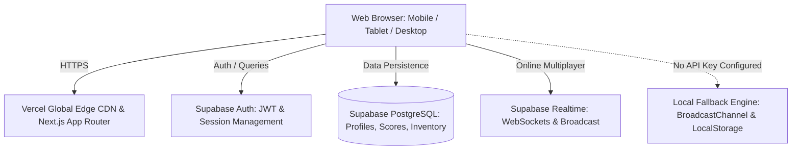

# Neo-Arcade Gaming Hub - Technical Design Specification

- **Date:** 2026-10-06
- **Status:** Approved
- **Target Audience:** Global web users across all mobile, tablet, and desktop devices
- **Hosting / Cost Model:** 100% Free & Scalable (Vercel Global Edge + Supabase Cloud)

---

## 1. Executive Summary & Goals

The **Neo-Arcade** platform is a modern, responsive, high-aesthetic web arcade hub. It blends the nostalgia of classic arcade games with cutting-edge web design inspired by [`ibelick/motion-primitives`](https://github.com/ibelick/motion-primitives), featuring smooth physics-based animations, glassmorphism, dynamic spotlight cards, and responsive controls.

### Core Objectives
1. **Worldwide Cross-Platform Accessibility:** 100% responsive layout on mobile, tablet, and desktop with low-latency CDN delivery.
2. **Cost-Free Production Infrastructure:** Zero monthly hosting fees using Vercel (Edge Functions & CDN) and Supabase (PostgreSQL, Auth, and WebSockets/Realtime).
3. **Robust Role-Based Access Control (RBAC):** Distinct `user` and `admin` roles, including full user management and instant ban/unban capabilities with customizable ban reasons.
4. **Rich Game Catalog:**
   - Single Player: *Retro Neon Snake* & *Cyber Flappy Bird*.
   - Multiplayer (Local 2-Player & Online Realtime): *Rock Paper Scissors Arena* & *Neon Tic-Tac-Toe*.
5. **Interactive Ecosystem (5 Enhanced Features):**
   - Global & Per-Game Leaderboards.
   - Daily Quests & Achievement Badges.
   - Coin & Cosmetic Skin Shop (custom snake/bird skins, avatar borders).
   - Realtime Room Matchmaking with In-Game Chat & Live Animated Reaction Emojis.
   - Procedural 8-bit Web Audio Synthesizer (instant zero-asset sound effects).
6. **Zero-Friction Local Fallback:** Works seamlessly out-of-the-box in local development with automatic localStorage/BroadcastChannel fallback if Supabase credentials are not yet configured.

---

## 2. System Architecture & Tech Stack



### Technology Breakdown
- **Framework:** Next.js (App Router, React 19/18, TypeScript)
- **Styling:** Tailwind CSS + Vanilla CSS Variables (Neo-Arcade dark theme tokens)
- **Motion & Interactions:** Framer Motion (replicating motion-primitives spotlight, tabs, dialogs, magnetic buttons, border beams)
- **Icons:** Lucide React
- **Sound Engine:** Native Web Audio API (procedural synthesis for jumps, hits, coins, win sounds without external assets)
- **Database & Auth:** Supabase PostgreSQL + Supabase Auth
- **Realtime Layer:** Supabase Realtime Broadcast Channels with browser `BroadcastChannel` local fallback

---

## 3. Database Schema (`supabase_schema.sql`)

### 3.1 Tables
```sql
-- Profiles table linked to auth.users
CREATE TABLE profiles (
  id UUID PRIMARY KEY REFERENCES auth.users(id) ON DELETE CASCADE,
  username VARCHAR(50) UNIQUE NOT NULL,
  avatar_url TEXT DEFAULT '',
  role VARCHAR(20) DEFAULT 'user' CHECK (role IN ('user', 'admin')),
  is_banned BOOLEAN DEFAULT false,
  ban_reason TEXT DEFAULT '',
  coins INTEGER DEFAULT 100,
  exp INTEGER DEFAULT 0,
  level INTEGER DEFAULT 1,
  created_at TIMESTAMPTZ DEFAULT NOW(),
  updated_at TIMESTAMPTZ DEFAULT NOW()
);

-- High Scores & Leaderboard
CREATE TABLE scores (
  id UUID PRIMARY KEY DEFAULT gen_random_uuid(),
  user_id UUID REFERENCES profiles(id) ON DELETE CASCADE,
  username VARCHAR(50) NOT NULL,
  game_type VARCHAR(30) NOT NULL CHECK (game_type IN ('snake', 'flappy', 'rps', 'tictactoe')),
  score INTEGER NOT NULL,
  created_at TIMESTAMPTZ DEFAULT NOW()
);

-- Game Rooms for Multiplayer
CREATE TABLE game_rooms (
  id UUID PRIMARY KEY DEFAULT gen_random_uuid(),
  room_code VARCHAR(10) UNIQUE NOT NULL,
  game_type VARCHAR(30) NOT NULL,
  host_id UUID REFERENCES profiles(id),
  guest_id UUID REFERENCES profiles(id),
  status VARCHAR(20) DEFAULT 'waiting' CHECK (status IN ('waiting', 'playing', 'finished')),
  game_state JSONB DEFAULT '{}'::jsonb,
  created_at TIMESTAMPTZ DEFAULT NOW()
);

-- User Inventory for cosmetics
CREATE TABLE user_inventory (
  id UUID PRIMARY KEY DEFAULT gen_random_uuid(),
  user_id UUID REFERENCES profiles(id) ON DELETE CASCADE,
  item_id VARCHAR(50) NOT NULL,
  item_type VARCHAR(30) NOT NULL,
  is_equipped BOOLEAN DEFAULT false,
  purchased_at TIMESTAMPTZ DEFAULT NOW(),
  UNIQUE(user_id, item_id)
);
```

### 3.2 Security & Row Level Security (RLS)
- Public read access on `profiles` (for leaderboard and usernames) and `scores`.
- Users can update their own profile avatar and equipped items.
- Only users with `role = 'admin'` can update `is_banned` and `ban_reason` on other profiles.
- Automated triggers on user signup to initialize profile row with 100 starter coins.

---

## 4. Authentication, Authorization & Moderation

### 4.1 Authentication Flow
1. **Registration:**
   - Validates username uniqueness, valid email format, and password strength (min 6 characters).
   - Generates default avatar and awards 100 bonus coins.
2. **Login:**
   - Verifies credentials.
   - Immediately evaluates `is_banned`:
     - If `is_banned === true`: Aborts login session, displays dialog: *"Tài khoản của bạn đã bị khóa. Lý do: [ban_reason]"*.
3. **Live Ban Interceptor:**
   - Any user action or route change checks `is_banned`. If flagged, session is cleared, an alert modal triggers, and the client is redirected to the home screen.

### 4.2 Admin Portal (`/admin`)
- **Access Rule:** Accessible only when `currentUser.role === 'admin'`. Unauthorized users are redirected with an alert.
- **Admin Capabilities:**
  - View KPI dashboard: Total users, active users, banned users, games played.
  - Search and filter users by username, email, and status.
  - **Ban / Unban Action:**
    - Clicking "Khóa tài khoản" opens a modal to specify a reason (e.g., "Gian lận điểm số", "Ngôn từ độc hại", or custom text).
    - Updates `is_banned = true` and `ban_reason = reason`.
    - Prevents admins from banning their own account.
    - Clicking "Mở khóa" restores account to normal standing.
- **Default Seed Admin for Instant Demo:**
  - Email: `admin@arcade.dev` | Password: `Admin@123456`

---

## 5. Game Mechanics & Realtime Architecture

### 5.1 Game 1: Neon Snake (Single Player)
- **Engine:** HTML5 2D Canvas with neon glow filters.
- **Controls:** Arrow Keys / WASD for desktop; On-screen virtual D-pad and gesture swipe for mobile.
- **Dynamics:** 
  - Progressive speed ramp as the snake grows.
  - Normal green food (+10 pts, +1 coin) & Rare golden fruit (+50 pts, +5 coins, 5-second lifetime).
  - High score automatically submitted to Leaderboard.

### 5.2 Game 2: Cyber Flappy (Single Player)
- **Engine:** Physics-based Canvas loop with gravity, tap impulse, and dynamic neon pipes.
- **Controls:** Spacebar, Mouse click, or Screen tap.
- **Dynamics:**
  - Day/Night gradient cycle.
  - Precise AABB collision box detection.
  - Medal awards: Bronze (10+ pts), Silver (25+ pts), Gold (50+ pts).

### 5.3 Game 3: Rock Paper Scissors Arena (2-Player Local & Online)
- **Modes:**
  - **Local Mode (Same Device):** Player 1 (Keys A/S/D or secret touch tap) vs Player 2 (Keys J/K/L or secret touch tap). Simultaneous dramatic reveal with 3-2-1 countdown.
  - **Online Realtime Mode:**
    - Host creates room $\rightarrow$ 6-character room PIN generated.
    - Opponent enters PIN to join.
    - 5-second blind choice timer.
    - Synchronized reveal with animated clash effect and best-of-3 / best-of-5 scoreboard.
    - In-room live chat & interactive floating emoji reactions.

### 5.4 Game 4: Neon Tic-Tac-Toe (2-Player Local & Online)
- **Modes:** Local Pass & Play and Online Realtime via room PIN.
- **Dynamics:**
  - Neon Cyan 'X' and Neon Magenta 'O' with glow animations.
  - Victory line detection with radiant stroke animation and haptic sound.

### 5.5 Realtime Synchronization Protocol
- Uses **Supabase Realtime Broadcast Channel** scoped to room ID (`room:${room_code}`).
- Event payload types:
  - `PLAYER_JOINED`: Broadcasts guest information.
  - `MAKE_MOVE`: Transmits blinded move or grid coordinate.
  - `REVEAL_ROUND`: Synchronizes outcome calculation.
  - `CHAT_MESSAGE`: Realtime text message inside room.
  - `EMOJI_REACTION`: Spawns animated floating reaction bubbles on both screens.
- **Fallback Mode:** In offline/mock mode, leverages browser `BroadcastChannel("neo-arcade-room")` so multiple browser tabs simulate online play locally.

---

## 6. Extra Features Specification

1. **Global & Per-Game Leaderboards (`/leaderboard`):**
   - Filter by All-Time, Weekly, and Game Type (Snake, Flappy, RPS, Tic-Tac-Toe).
   - Top 3 players highlighted with gold, silver, and bronze illuminated pedestal badges.
2. **Daily Quests & Achievements (`/quests`):**
   - Quests reset every 24h (e.g., "Ăn 30 quả táo trong Snake", "Chơi 3 trận Oản tù tì").
   - Completing quests rewards bonus coins and player XP/Levels.
3. **Shop & Cosmetics (`/shop`):**
   - Snake skins (Neon Emerald, Cyber Cyan, Solar Gold, Rainbow Wave).
   - Flappy Bird skins (Classic Yellow, Cyber Drone, Phoenix Red).
   - Custom Avatar Frames and Titles.
4. **Live Chat & Emoji Reactions:**
   - Instant chat box inside game rooms with 1-click emoji buttons (🔥, 🏆, 😂, 😡, 😭) that burst across both players' screens.
5. **Procedural Web Audio Sound Synthesizer:**
   - Zero external audio files to download. Utilizes `AudioContext` oscillators (square, triangle, sine) to produce nostalgic 8-bit sound fx.
   - Master mute/unmute toggle persistent in localStorage.

---

## 7. UI/UX & Motion-Primitives Design System

- **Aesthetic Theme:** Neo-Arcade Dark Mode.
- **Design Tokens:**
  - Background: `#09090b` (Deep obsidian slate) with subtle retro dot matrix background.
  - Surface Glass: `rgba(24, 24, 27, 0.7)` with `backdrop-filter: blur(16px)` and `border: 1px solid rgba(255, 255, 255, 0.08)`.
  - Neon Cyan: `#06b6d4` / Neon Violet: `#a855f7` / Neon Amber: `#f59e0b`.
- **Motion Primitives Components:**
  - `SpotlightCard`: Dynamic cursor-tracking radial gradient glow.
  - `AnimatedTabs`: Framer Motion layoutId pill indicator for mode switching.
  - `MagneticButton`: Smooth cursor pull on hover with bounce physics.
  - `ShimmerText`: Radiant gradient sweep across high-priority headings and badges.
  - `BorderBeam`: Glowing beam looping around champion cards and victory modals.
  - `SpringDialog`: Gentle spring transition with backdrop blur.

---

## 8. Deployment Strategy (100% Free Production)

### Step-by-Step Deployment Guide
1. **Supabase Cloud Setup (Free Tier):**
   - Register at `https://supabase.com`.
   - Create project "neo-arcade" (Region: Singapore for lowest Asian ping).
   - Paste `supabase_schema.sql` into the SQL Editor and click **Run**.
   - Copy `Project URL` and `anon public key`.
2. **GitHub Deployment:**
   - Push codebase to personal GitHub repository.
3. **Vercel Edge Deployment (Free Tier):**
   - Connect GitHub repo at `https://vercel.com`.
   - Configure Environment Variables:
     - `NEXT_PUBLIC_SUPABASE_URL = <your-supabase-url>`
     - `NEXT_PUBLIC_SUPABASE_ANON_KEY = <your-supabase-anon-key>`
   - Click **Deploy**. Vercel automates build, optimization, and issues free SSL domain `https://<project-name>.vercel.app`.

---

## 9. Verification & Quality Assurance

- **Cross-device testing:** Desktop mouse/keyboard, mobile touch/virtual D-pad.
- **Auth & RBAC tests:** Verify admin access, verify banned user blocked from login and active session kicked with ban reason modal.
- **Realtime multiplayer tests:** Verify multi-tab / multi-client room sync and emoji broadcast.
- **Offline / Graceful degradation tests:** Ensure full app operability even before Supabase keys are configured.
